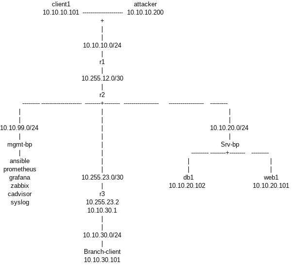

## 1. Johdanto
Kurssilla käytettävä virtuaalinen verkkoympräistö simuloi yritysverkkoa. Kurssilla käytetään avoimen lähdekoodin ohjelmistoja, joiden avulla harjoitellaan verkon keskitettyä valvontaa, havainnointia ja hallintaa.  
.  ## 2. Verkkokaavio
Verkkoympäristön topologia 
<figure>
  
  <figcaption>Kuva 1. Verkkoympäristön topologiakaavio</figcaption>
</figure>

## 3. Laiteluettelo

Laiteluettelo on kuvattuna alla olevassa taulukossa.

 
*Taulukko  1. Laiteluettelo, josta käy ilmi verkkoympäristön laitteet ja niiden tarkoitukset.* 
| Laite         | Tarkoitus                                                                                           |
| ------------- | --------------------------------------------------------------------------------------------------- |
| r1            | Reititin r2 ja client1 sekä attacker välissä                                                        |
| r2            | "Solmukohdan reititin". r2 on r1 ja r3 välissä lisäksi yhteydet hallinta- ja palvelinverkkoihin.    |
| r3            | Reititin r2 ja branch client välissä                                                                |
| client1       | Päätelaite esim. Pc                                                                                 |
| attacker      | Päätelaite tietoturvatestaukseen                                                                    |
| web1          | Web-palvelin                                                                                        |
| db1           | Tietokantapalvelin                                                                                  |
| Branch-client | Sivukonttorissa oleva päätelaite                                                                    |
| ansible       | Hallinta- ja automaatiopalvelin. Muiden laitteiden keskitettyyn hallintaan.                         |
| prometheus    | Valvonta- metriikkapalvelin verkon valvlontaan                                                      |
| grafana       | Edellisen tuottaman datan visualisointiin tarkoitettu palvelu                                       |
| zabbix        | Verkon laitteiden ja palveluiden keskitettyyn valvontaan käytettävä järjestelmä                     |

## 4. IP-suunnitelma

IP-suunnitelma on kuvattuna alla olevassa taulukossa. 

*Taulukko  2. IP-suunnitelma/IP-osoitteiden dokumentointi.*
| Verkko         | Yhdyskäytävä | Verkon laitteet                                                     | Mikä reititin toimii yhdyskäytävänä | Mitä tarkoitusta verkko palvelee                                                                       |
| -------------- | ------------ | ------------------------------------------------------------------- | ----------------------------------- | ------------------------------------------------------------------------------------------------------ |
| 10.10.10.0/24  | 10.10.10.1   | r1, client1, attacker                                               | r1                                  | Paikallinen verkko, jossa on päätelaite ja tietoturvan testaamiseen tarkoitettu päätelaite             |
| 10.10.20.0/24  | 10.10.20.1   | r2, db1, web1, srv-bp                                               | r2                                  | Palvelinverkko, jossa on kytkin (srv-bp) sekä tietokantapalvelin (db1) ja Web-pavelin (web1)           |
| 10.10.30.0/24  | 10.10.30.1   | r3, branch-client                                                   | r3                                  | Paikallinen verkko, jossa on sivukonttorin päätelaite                                                  |
| 10.10.99.0/24  | 10.10.99.1   | r2, mgmt-bp, ansible, prometheus, grafana, zabbix, cadvisor, syslog | r2                                  | hallintaverkko, jossa on verkon keskitettyyn hallintaan ja valvontaan käytettävät laitteet ja työkalut |
| 10.255.12.0/30 | 10.255.12.1  | r1, r2                                                              | r1                                  | Reitittimien 1 ja 2 välinen verkko                                                                     |
| 10.255.23.0/30 | 10.255.23.2  | r2, r3                                                              | r2                                  | Reitittimien 2 ja 3 välinen verkko                                                                     |

## 5. Reitityksen analyysi

Yhteyksien testaaminen aloitettiin kirjautumalla client-1 laitteelle ja suorittamalla komento "ping -c 4 10.10.20.101", joka pingaa web1-palvelimen IP-osoitetta  (Kuva1). Pingaus menee läpi ja kaikki paketit saivat vastauksen. Tämän pingauksen perusteella yhteys verkkoon 10.10.20.0/24 client-1 asemalta (verkosta 10.10.10.0/24, yhdyskäytävää 10.10.10.1 pitkin) onnistui. 

Seuraavaksi edelleen kirjautuneena client-1 laitteelle suoritettiin komento "ping -c 4 10.10.30.101", joka pingaa branch-verkon päätelaitetta (Kuva 1). Tämäkin toimi ja kaikki paketit saivat vastauksen. Tämän pingauksen perusteella yhteys client-1 asemalta branch-verkkoon toimii (10.10.30.0/24).

branch-client päätelaitteelle kulkevaa reittiä tutkittiin vielä tarkemmin komennolla traceroute 10.10.30.101. Traceroute antoi seuraavan reitin:
1. 10.10.10.1
2. 10.255.12.2
3. 10.255.23.2
4. 10.10.30.101

Ensimmäinen hyppy (hop) on r1-reititin, toinen hyppy on r2 reititin kolmas hyppy on r3-reititin ja neljäs hyppy on branch-client-päätelaite (Kuva 1).
   

### ip addr-komennon tuloste
root@client1:/# ip addr

1: lo: <LOOPBACK,UP,LOWER_UP> mtu 65536 qdisc noqueue state UNKNOWN group default qlen 1000

link/loopback 00:00:00:00:00:00 brd 00:00:00:00:00:00
inet 127.0.0.1/8 scope host lo
valid_lft forever preferred_lft forever
inet6 ::1/128 scope host 
       valid_lft forever preferred_lft forever

2: eth0@if9320: <BROADCAST,MULTICAST,UP,LOWER_UP> mtu 1500 qdisc noqueue state UP group default 
    link/ether 0e:b4:c3:ec:eb:07 brd ff:ff:ff:ff:ff:ff link-netnsid 0
    inet 172.20.20.7/24 brd 172.20.20.255 scope global eth0
       valid_lft forever preferred_lft forever

9322: eth1@if9321: <BROADCAST,MULTICAST,UP,LOWER_UP> mtu 9500 qdisc noqueue state UP group default 
    link/ether aa:c1:ab:c9:6c:4f brd ff:ff:ff:ff:ff:ff link-netnsid 1
    altname clab-o-05031180f95d8850
    inet 10.10.10.101/24 scope global eth1
       valid_lft forever preferred_lft forever
    inet6 fe80::a8c1:abff:fec9:6c4f/64 scope link 
       valid_lft forever preferred_lft forever

### ip route-komennon tuloste
root@client1:/# ip route

default via 10.10.10.1 dev eth1 
10.10.10.0/24 dev eth1 proto kernel scope link src 10.10.10.101
 
172.20.20.0/24 dev eth0 proto kernel scope link src 172.20.20.7 

### ping -c 4 10.10.20.101-komennon tuloste
root@client1:/# ping -c 4 10.10.20.101

PING 10.10.20.101 (10.10.20.101) 56(84) bytes of data.

64 bytes from 10.10.20.101: icmp_seq=1 ttl=62 time=0.540 ms

64 bytes from 10.10.20.101: icmp_seq=2 ttl=62 time=0.123 ms

64 bytes from 10.10.20.101: icmp_seq=3 ttl=62 time=0.115 ms

64 bytes from 10.10.20.101: icmp_seq=4 ttl=62 time=0.159 ms

--- 10.10.20.101 ping statistics ---

4 packets transmitted, 4 received, 0% packet loss, time 3094ms

rtt min/avg/max/mdev = 0.115/0.234/0.540/0.177 ms

### ping -c 4 10.10.30.101
root@client1:/# ping -c 4 10.10.30.101

PING 10.10.30.101 (10.10.30.101) 56(84) bytes of data.

64 bytes from 10.10.30.101: icmp_seq=1 ttl=61 time=0.135 ms

64 bytes from 10.10.30.101: icmp_seq=2 ttl=61 time=0.175 ms

64 bytes from 10.10.30.101: icmp_seq=3 ttl=61 time=0.128 ms

64 bytes from 10.10.30.101: icmp_seq=4 ttl=61 time=0.129 ms

--- 10.10.30.101 ping statistics ---

4 packets transmitted, 4 received, 0% packet loss, time 3089ms

rtt min/avg/max/mdev = 0.128/0.141/0.175/0.019 ms

### traceroute 10.10.30.101-komennon tuloste
root@client1:/# traceroute 10.10.30.101

traceroute to 10.10.30.101 (10.10.30.101), 30 hops max, 60 byte packets

 1  10.10.10.1 (10.10.10.1)  0.900 ms  0.829 ms  0.798 ms

 2  10.255.12.2 (10.255.12.2)  0.770 ms  0.724 ms  0.690 ms

 3  10.255.23.2 (10.255.23.2)  0.644 ms  0.596 ms  0.548 ms

 4  10.10.30.101 (10.10.30.101)  0.508 ms  0.453 ms  0.404 ms

## 6. Yhteenveto

Ajankäyttöön liittyen eniten aikaa tuntui menevän työkaluihin tutustumiseen ja niiden asennukseen. Myös verkkoympäristön toiminnan ja komentojen ihmettelyyn meni melko paljon aikaa. Oppimiskäyrä on tässä kohtaa ollut jyrkkä. Tässä kohtaa tuli runsaasti uutta asiaa, alkaen raportointityökaluista. Markdownin harjoitteluun meni yllättävän paljon aikaa. Jonkinnäköinen hyvien käytäntöjen mukaan tehty malliasiakirja siitä miltä verkkodokumentaation oikeasti tulisi näyttää olisi hyödyllinen.

Hyvin tehty dokumentaatio nopeuttaa valtavasti ongelmien ratkomista ja toimenpiteiden tekemistä, kun verkkoja ja yhteyksiä ei tarvitse alkaa selvittää. Dokumentaatio auttaa myös arvioimaan työaikaa ja kustannuksia, joita mahdolliset toimenpiteet vaativat.  

Tekoälyn käyttö: Käytin Chat GPT (GPT-5.6 Sol) Exceliin kirjoitettujen Markdown-taulukoiden muuntamiseen, sekä yleisesti Markdowniin tutustumisen apuna. Käytin mallia myös apuna yrittäessäni   
